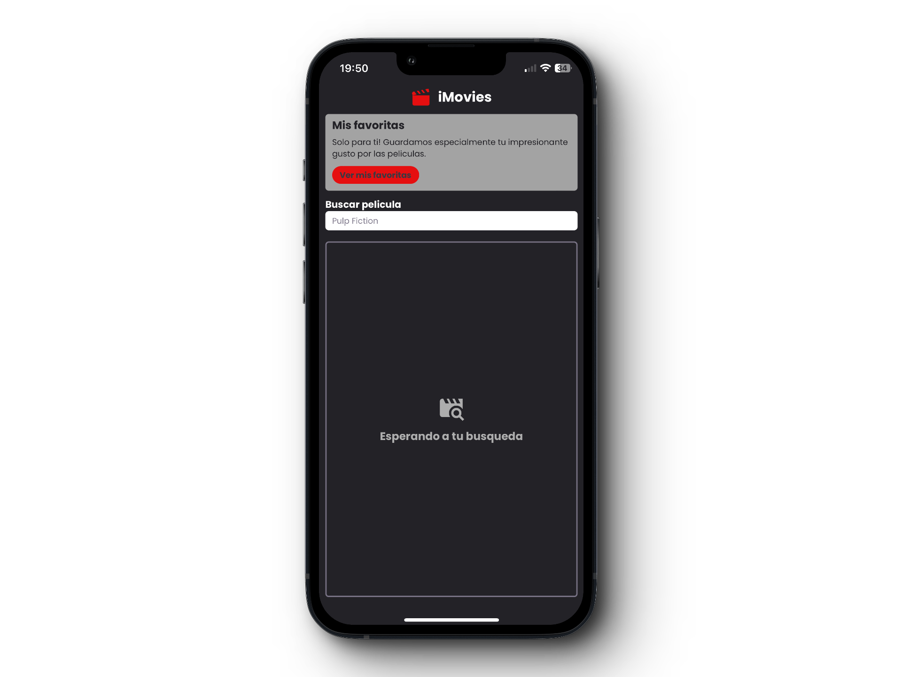
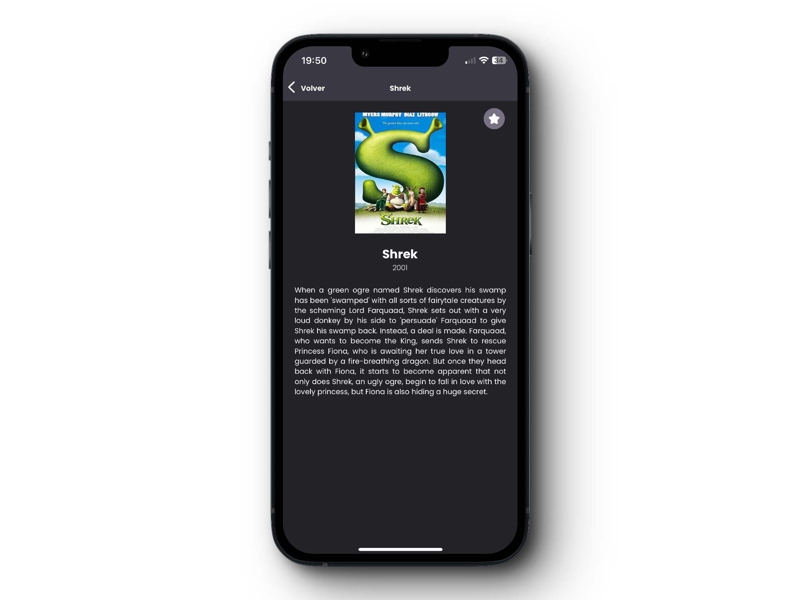
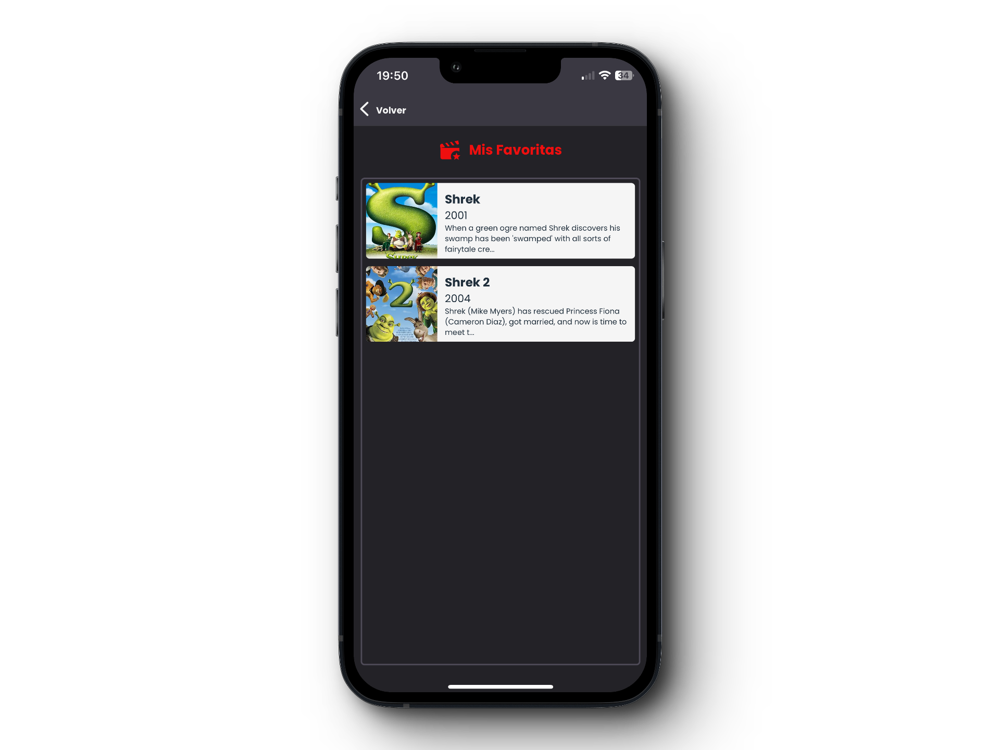

# iMovies

Este documento proporciona información detallada sobre la estructura y funcionalidad del proyecto iMovies, una aplicación de búsqueda y gestión de películas.

## 🔨 Requerimientos

- 🧱 Expo SDK v49
- 🐛 React Native v0.72
- 🐎 YARN v1.22.19
- 🐎 NPM v9.8.0

Proyecto disponible para

- 🤖 Android
- 🐦 iOS
- 📌 WEB

Proyecto desarrollado en **TypeScript**!

## 🐛 Variables de entorno

Es necesario definir el API_KEY del servicio de OMDB. Puedes obtener tu propia API_KEY entrando a [OMDB](https://www.omdbapi.com/).

```
  API_KEY="api_key here"
```

## 🦎 Instalación

El proyecto y sus dependencias puede ser manejado tanto con NPM como con YARN. Aunque se recomienda el uso de YARN.

```bash
  $yarn install

  $npm install
```

Iniciar la aplicación

```bash
  $yarn run serve
```

## Mockups

A continuación, se presentan los mockups que visualizan la interfaz de usuario de la aplicación iMovies. Estos mockups ofrecen una representación gráfica de las tres pantallas principales: la pantalla de búsqueda, la pantalla de detalles de la película y la pantalla de favoritos.

<div style="display:flex; justify-content:center; align-items:center; width:100%">
  
  
  
</div>

## DEMO

DEMO de iMovies permite a los usuarios experimentar de primera mano las funciones clave de la aplicación. Durante la demostración, los usuarios pueden realizar búsquedas de películas, explorar detalles exhaustivos de cada película seleccionada y gestionar su lista personal de favoritos. La interfaz de usuario intuitiva guía a los usuarios a través de las diversas pantallas, brindando una experiencia fluida y enriquecedora. La demostración destaca la eficacia de la aplicación al integrar la API de OMDB para obtener información actualizada y detallada sobre las películas.

<div style="display:flex;justify-content:center;width:100%;">
  
</div>

## Notas del desarrollador

Para mantener una lista de películas favoritas accesible en toda la aplicación, fue necesaria la implementación de un gestor de estados global. Se optó por utilizar Zustand, el cual no presenta mucha complejidad y se integra rápidamente en proyectos de diversas escalas.

Con el objetivo de desarrollar rápidamente las capacidades necesarias, se decidió no profundizar demasiado en un CRUD de favoritos, concentrándose únicamente en los componentes CREATE & READ.
